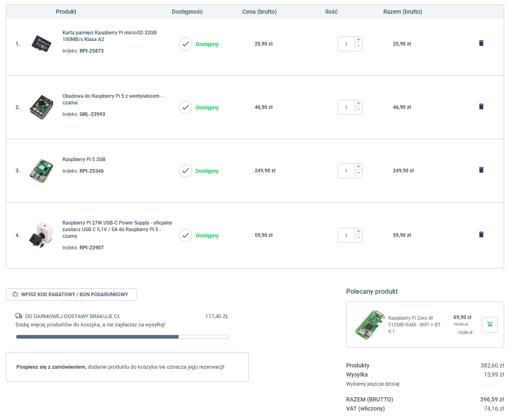
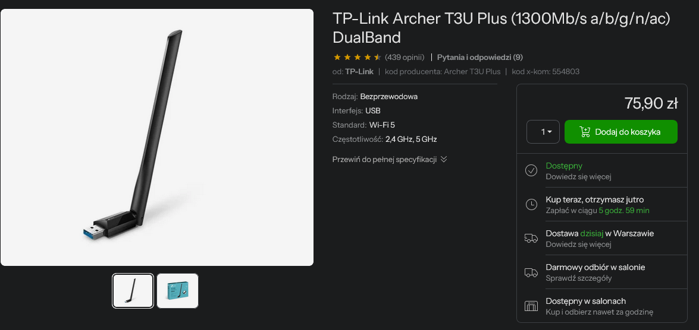

#   Raspberry PI parts for portable and small-factor client device

## Example Build
"TV BOX" can be deployed on Raspberry PI which can be configured to specific requirements and for specific localization. Below the example build with example links for my local supplier:

- Raspberry Pi 5 2GB RAM:
[https://botland.com.pl/moduly-i-zestawy-raspberry-pi-5/25346-raspberry-pi-5-2gb-5056561803302.html](https://botland.com.pl/moduly-i-zestawy-raspberry-pi-5/25346-raspberry-pi-5-2gb-5056561803302.html)

- Power supply (USB C 5,1V / 5A | 27W):
[https://botland.com.pl/zasilacze-do-raspberry-pi-5/23907-raspberry-pi-27w-usb-c-power-supply-oficjalny-zasilacz-usb-c-51v-5a-do-raspberry-pi-5-czarny-5056561803418.html](https://botland.com.pl/zasilacze-do-raspberry-pi-5/23907-raspberry-pi-27w-usb-c-power-supply-oficjalny-zasilacz-usb-c-51v-5a-do-raspberry-pi-5-czarny-5056561803418.html)

- At least A2 Class SD Card 32GB, pick 64GB to be sure your media folder would fit:
[https://botland.com.pl/karty-pamieci-raspberry-pi/25742-karta-pamieci-raspberry-microsd-64gb-100mbs-klasa-a2-z-systemem-raspberry-pi-os-z-adapterem-oraz-etui-w-zestawie-5056561804927.html](https://botland.com.pl/karty-pamieci-raspberry-pi/25742-karta-pamieci-raspberry-microsd-64gb-100mbs-klasa-a2-z-systemem-raspberry-pi-os-z-adapterem-oraz-etui-w-zestawie-5056561804927.html)

- Case for the safety and easier montage of the device | It's advised to use cooling FAN since device can get hot in certain locations and playing high quality video media:
[https://botland.com.pl/obudowy-do-raspberry-pi-5/23993-obudowa-do-raspberry-pi-5-z-wentylatorem-czarna-5906063496024.html](https://botland.com.pl/obudowy-do-raspberry-pi-5/23993-obudowa-do-raspberry-pi-5-z-wentylatorem-czarna-5906063496024.html)
 | Alternative cheap case (less resistant): [https://botland.com.pl/obudowy-do-raspberry-pi-4b/16791-obudowa-justpi-do-raspberry-pi-4b-z-wentylatorem-czarna-5903351242615.html](https://botland.com.pl/obudowy-do-raspberry-pi-4b/16791-obudowa-justpi-do-raspberry-pi-4b-z-wentylatorem-czarna-5903351242615.html)

- WI-FI Network card with long antenna and support for many WI-FI standards (optional - Pi5 have quite nice built in card):
[https://www.x-kom.pl/p/554803-karta-sieciowa-tp-link-archer-t3u-plus-1300mb-s-a-b-g-n-ac-dualband.html](https://www.x-kom.pl/p/554803-karta-sieciowa-tp-link-archer-t3u-plus-1300mb-s-a-b-g-n-ac-dualband.html)

For this setup remember to set screen resolution o 1920x1080 60FPS max to prevent stuttering and lags. The FAN will spin after system shutdown as long as the power is provided for the device. It also spins up when plugged in to the wall outlet. It's just plugged into 2 pins on the board that receive.