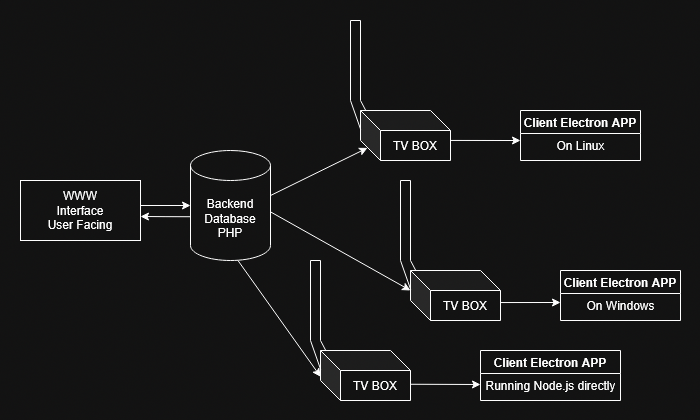

# Overall design

For safety app does not receive and listen for any commands. It checks state of the server, downloads data and executes functions on it self. After switching it on its "fire and forget" <span style="text-decoration: line-through;">missile</span> system.

Made to use with `.jpg` and `.mp4` files. Thats whats programmed for, you can add more formats -> edit upload php and electron client app source code.

TODO: Email notification system - as follows -> In database the notification table have TINYINT/BOOL value that determines if notification was sent.The server runs CRON task executing script that creates and sends in email all notifications that have value of 0 in the `email_sent` column. Than after sending the email. Sent notifications `email_sent` values are set to 1.
The system also have logic in generating notifications - for example checks if any device is offline more than 1hour and creates notification that is also sent to established email.

//PHP MAILER if PHP script //in admin panel email notifications btn to configure mail server -> save settings into file

//GetConfig in the client app got redone from downloading JSON from server to generating json locally. Somehow on localhost everything worked fine, but after deploy to remote server the app downloaded configuration that was 1version behind the current configuration even when the file on the server got rewritten. The database was up to date, the file configs ware overwritten, but the client some how was getting file that should not be even there. Bet the www CACHE got something to do with it. Now it's based on DB and client side JSON creation.

Inside `display.php` and `media.php` - video tags have by default inserted `preload="none"`, to prevent huge downloads, lag spikes and load times if deployed in remote location that isn't local-hosted or super fast. The attribute can be removed in PHP sections dedicated to displaying media.

WWW Interface shows status of the devices as colored dots. There are 4 states of the devices, with 3 default states `(GREEN,YELLOW,RED)` and 1 default `(BLUE)`. Blue state is set by default when device was added by hand into database or the timestamp of last dbPing is empty. If you see blue and you operate client devices correctly - something went wrong. Status can become `YELLOW` or even `RED` while internet is slow or client has a lot to download into local `/media` folder from (for example) slow server. Than in the meantime (downloading time) there are no dbPings, so the device may seem offline for that time. If you want to be sure - ssh into the device. If you can connect - it works and internet is up, you can check if TV BOX app is running or XRDP (if configured) to check screen.

The original plan was to omit usage of database, but since it would greatly limit www interface - the plan changed. Since that change the JSON is now generated by devices not www interface, and instead of downloading file from the server, client sends query to DB. It now depends on reliable database, don;t worry the app will work even when client internet is gone or database is offline. It will display based of the current config and files, until detection of the internet and database.

The design also allows configuring device to connect to local database and even local media folder, provided data integrity - database cloning from remote source and cloning of source media folder. That can be achieved even by simply syncing data from server to clients by for example mega.nz application, same for database ->main database on the www interface cloned into `localhosts` of clients.

Empty Indexes in www interface folders like `/media` are there to prevent listing files. However since those files are public anyway, you can safely delete that index file. Other empty indexes can be deleted too (except `/log` - even having `.htaccess` I would not delete that empty index). Their existence is purely for esthetic reasons.

You can restrict direct access for `/media` and other folders by writing `.htaccess` file with `Deny All`

If you change channel of the device, te ensure the device will get new config save channel configuration. Device could have date that is newer or older than configuration date of your channel, so you have 50% chance it will download new config. To avoid that 50% loose -> every time the device changes channel -> save channel config.

Do not delete files - videos and images UNTIL they are no longer in any config file in devices! Until then every device on startup will try to reach up to the server and download that file - than update it's configuration. In other words - until all devices are up to date and have config files updated, do not delete files used in previous configuration from the server. Otherwise you wil get CURL (18) ERROR.

Admin user in WWW interface can add/delete Users and change all users passwords. Admin can also see logs of the WWW interface. The `admin.php` (Admin Panel) is shown and can be accessed only by admins.

## EXAMPLE CRON //for sending emails with notifications

* `Here example cron` - checks for unsent notifications every 10 min.
* `Here example cron` - checks for unsent notifications every day at 9:00 am.

## Project layout (most important things)

SERVER SIDE

    login.php
    media/  # Upload folder for all media/folder to point app to download from.
    log/    # WWW Interface action/error logs

CLIENT SIDE

    main.js         # Main program
    renderer.js     # Renderer
    media/
        example.mp4   # Downloaded from media folder on the server.
        example.jpg   # Downloaded from media folder on the server.
        ...

## TV BOX - How does it work?

At program start - initiates it self and tries to download files from present config.json file, using settings in db_config.json and remote_config.json.

Program loop is executing every 10 minutes by default. Currently you have to edit the code to set up different timer. // TO DO - load timer from file in client and server.

Communication is based on .json files generated and stored on the server.Clients do not listen to anything. They make queries to db to check, if timestamp of config on the server is same or greater of locally stored timestamp. If timestamp on the server is newer, the client downloads new configuration file and than after the check starts downloading files from media folder on the server.

The client does not need reload or relaunch of the application. Clients listen to any changes to their local configuration file. If detected, they automatically apply changes.

Files from new configuration file are download into temp folder, so if internet connection breaks or the file download fails, changes will not be 'saved' and the system will work on previous config without interruptions.

The www panel login system is simple and it's recommended to secure it additionally to the systems that are present. HGashes are stored in DB as bcrypt (PHP standard) and there is simple anti BRUTE-FORCE system present. Securing login form with some CAPTCHA would be great. Securing your website or at least subdomain with the app using CloudFlare can bew helpful and it's recommended,

CLient Device after powering up and proper configuration will show up automatically in the web interface. It looks for 'UPDATE' query, but when record is not present - uses 'INSERT' instead.

When adding video into channel the www panel automatically checks the length of the video [thanks to getID3](https://github.com/nass600/getID3) and sets the value for ease of use.

##  Simple system schema



## Database
SQL server used to develop the app was **MariaDB**. If you are using different database, make sure to check all queries and DB Schema to avoid problems. Sql file should be easy to convert into other DB's like PostgreSQL, since structure and types are very basic. You could do it even by hand.

## How device 'playlist' config file looks like after program makes it
```
[
    {
        "type": "video",
        "name": "1.mp4",
        "timer": 10
    },
    {
        "type": "image",
        "name": "1.jpg",
        "timer": 3
    },
    {
        "type": "video",
        "name": "2.mp4",
        "timer": 10
    },
    {
        "type": "video",
        "name": "3.mp4",
        "timer": 10
    },
    {
        "type": "image",
        "name": "2.jpg",
        "timer": 3
    },
    {
        "type": "image",
        "name": "3.jpg",
        "timer": 3
    }
]
```

> **ProTip:** You can totally avoid using www interface and write yourself other application that will allow generation of config files. All you need is DB and synchronized media folder for end devices to work properly.

- What can be done:

Notifications when database is down/device can't connect to it. Requires making API in PHP or adding SFTP ability to put notification as file -> use booth DB and file based notification system simultaneously.

More secure login - captcha like method by default in background than shown if needed

Mail system for new notifications //as described above

Sending things in JS to avoid refreshing website, but since I'm "refresh the page + PHP" enjoyer + don't like JS (KEKW wrote Electron.js client BTW) - I wil most likely not do that.

Some JS for frontend to avoid using "move up" and "move down" and rearrange images and videos in display.php by hand that send changes one click. For example send array into PHP.

You can add custom in app or in www interface notifications - for example -> type 'INFO' after the app downloads and moves data = signals that new config and files are correctly loaded